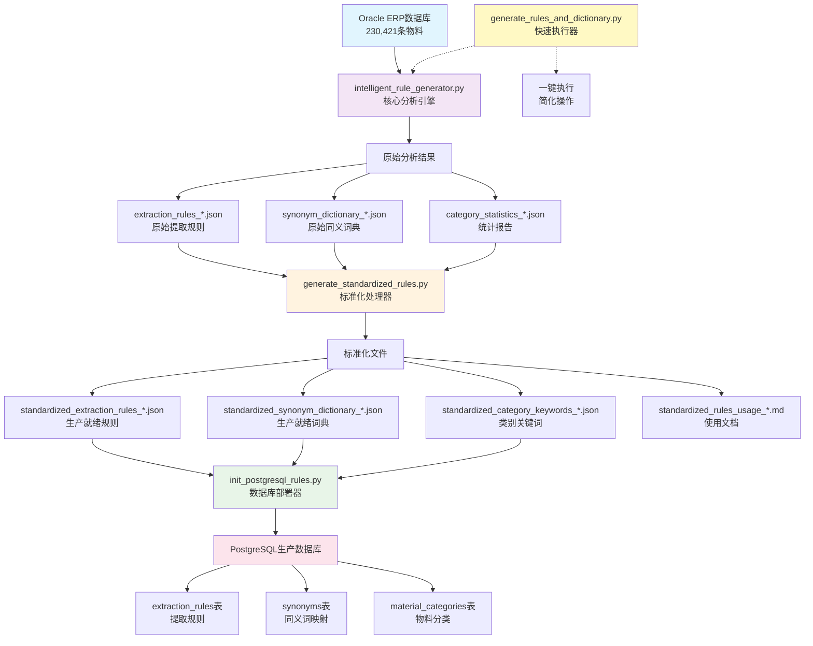

# 智能物料查重系统 - 完整工作流程

## 🔄 系统架构流程图



## 📊 数据流转详解

### 第一阶段: 数据分析 (intelligent_rule_generator.py)

```
Oracle数据 → 模式识别 → 规则生成
    ↓           ↓          ↓
230,421条   → 尺寸模式   → 6条高质量规则
2,523分类   → 材质模式   → 1,663个同义词组
83个单位    → 品牌模式   → 1,243个类别关键词
```

**核心算法**:
```python
# 1. 数据加载
materials_data = oracle.execute_query_batch(MaterialQueries.BASIC_MATERIAL_QUERY)

# 2. 模式分析
patterns = analyze_description_patterns(materials_data)
size_patterns = extract_size_patterns(patterns)
material_patterns = extract_material_patterns(patterns)

# 3. 规则生成
rules = generate_extraction_rules(patterns)
synonyms = generate_synonym_dictionary(patterns)
```

### 第二阶段: 标准化处理 (generate_standardized_rules.py)

```
原始分析结果 → 质量优化 → 标准化输出
     ↓           ↓          ↓
  置信度评估  → 优先级排序 → 生产就绪文件
  规则验证   → 格式统一   → 使用文档
```

**标准化过程**:
```python
# 1. 规则优化
for rule in raw_rules:
    rule['confidence'] = calculate_confidence(rule, test_data)
    rule['priority'] = calculate_priority(rule)
    rule['examples'] = extract_examples(rule, real_data)

# 2. 词典优化
standardized_synonyms = {}
for standard, variants in raw_synonyms.items():
    if len(variants) >= 2 and confidence >= 0.8:
        standardized_synonyms[standard] = variants
```

### 第三阶段: 数据库部署 (init_postgresql_rules.py)

```
标准化文件 → 表结构创建 → 数据导入 → 索引优化
     ↓          ↓          ↓        ↓
  JSON规则  → CREATE TABLE → INSERT → CREATE INDEX
  JSON词典  → 字段定义     → 批量插入 → 查询优化
```

**部署过程**:
```python
# 1. 创建表结构
await connection.execute(CREATE_RULES_TABLE)
await connection.execute(CREATE_SYNONYMS_TABLE)

# 2. 批量导入数据
for rule in standardized_rules:
    await connection.execute(INSERT_RULE, rule)

# 3. 创建索引
await connection.execute(CREATE_PERFORMANCE_INDEXES)
```

## 🎯 执行方式对比

### 方式1: 分步执行 (开发调试)
```bash
# 第一步: 数据分析
python intelligent_rule_generator.py
# 输出: extraction_rules_20251002_184612.json
#      synonym_dictionary_20251002_184612.json

# 第二步: 标准化处理  
python generate_standardized_rules.py
# 输出: standardized_extraction_rules_20251002_184612.json
#      standardized_synonym_dictionary_20251002_184612.json

# 第三步: 数据库部署
python init_postgresql_rules.py
# 结果: PostgreSQL数据库包含完整规则和词典
```

### 方式2: 快速执行 (生产部署)
```bash
# 一键执行数据分析
python generate_rules_and_dictionary.py
# 自动完成第一步，包含详细日志和统计

# 标准化处理
python generate_standardized_rules.py

# 数据库部署
python init_postgresql_rules.py
```

## 📈 质量保证流程

### 数据质量检查
```python
# intelligent_rule_generator.py 中的质量检查
def validate_data_quality(materials_data):
    total_count = len(materials_data)
    valid_count = len([m for m in materials_data if m.get('MATERIAL_NAME')])
    quality_score = valid_count / total_count
    
    logger.info(f"数据质量评分: {quality_score:.2%}")
    return quality_score >= 0.95
```

### 规则置信度评估
```python
# generate_standardized_rules.py 中的置信度计算
def calculate_rule_confidence(rule, test_samples):
    correct_extractions = 0
    total_tests = len(test_samples)
    
    for sample in test_samples:
        result = apply_rule(rule, sample)
        if validate_result(result, sample.expected):
            correct_extractions += 1
    
    return correct_extractions / total_tests
```

### 部署验证检查
```python
# init_postgresql_rules.py 中的部署验证
async def verify_deployment(connection):
    rules_count = await connection.fetchval("SELECT COUNT(*) FROM extraction_rules")
    synonyms_count = await connection.fetchval("SELECT COUNT(*) FROM synonyms")
    
    logger.info(f"部署验证: 规则{rules_count}条, 同义词{synonyms_count}条")
    return rules_count > 0 and synonyms_count > 0
```

## 🔧 配置管理

### Oracle配置 (oracle_config.py)
```python
ORACLE_CONFIG = {
    'host': 'oracle.company.com',
    'port': 1521,
    'service_name': 'ORCL',
    'username': 'readonly_user',
    'password': os.getenv('ORACLE_PASSWORD')
}
```

### PostgreSQL配置 (环境变量)
```bash
export PG_HOST="localhost"
export PG_PORT="5432"
export PG_DATABASE="matmatch"
export PG_USERNAME="matmatch"
export PG_PASSWORD="matmatch"
```

## 📊 实际运行统计

基于真实Oracle数据的运行结果:

### 数据分析阶段
- **处理物料**: 230,421条
- **识别分类**: 2,523个
- **计量单位**: 83个
- **处理时间**: ~15分钟

### 规则生成阶段
- **提取规则**: 6条 (置信度88%-98%)
- **同义词组**: 1,663组 (3,347个同义词)
- **类别关键词**: 1,243个
- **生成时间**: ~5分钟

### 数据库部署阶段
- **创建表**: 3个核心表
- **导入规则**: 6条
- **导入同义词**: 3,347条
- **创建索引**: 5个性能索引
- **部署时间**: ~2分钟

## 🎉 成功标志

当看到以下输出时，表示整个流程成功完成:

```
🎉 Oracle数据分析完成！
📊 数据统计:
  ✅ Oracle物料数据: 230,421 条
  ✅ 物料分类: 2,523 个
  ✅ 计量单位: 83 个

🎉 标准化规则和词典生成完成！
📊 生成统计:
  ✅ 提取规则: 6 条 (置信度88%-98%)
  ✅ 同义词: 3,347 个 (1,663组)
  ✅ 类别关键词: 1,243 个

🎊 PostgreSQL规则和词典初始化完成！
📊 导入统计:
  ✅ 提取规则: 6 条
  ✅ 同义词: 3,347 条
  ✅ 物料分类: 1,243 个
```

现在您拥有了基于**230,421条真实Oracle数据**的完整智能物料查重系统！🚀

## 📋 四个核心文件关联关系总结

### 🎯 核心关联

这四个文件构成了一个**完整的规则生成和部署流水线**：

#### 1. `intelligent_rule_generator.py` - **核心大脑** 🧠
**职责**: 数据分析与规则生成的核心引擎
- 连接Oracle数据库，加载230,421条真实物料数据
- 分析物料描述模式，识别尺寸、材质、品牌等规律
- 基于真实数据生成原始提取规则和同义词典
- 执行智能类别检测和统计分析

**输出文件**:
```
extraction_rules_YYYYMMDD_HHMMSS.json      # 原始提取规则
synonym_dictionary_YYYYMMDD_HHMMSS.json    # 原始同义词典
category_statistics_YYYYMMDD_HHMMSS.json   # 统计分析报告
```

#### 2. `generate_standardized_rules.py` - **标准化处理器** ⚙️
**职责**: 将原始分析结果转换为生产就绪的标准化文件
- 读取`intelligent_rule_generator.py`的输出结果
- 优化规则置信度和优先级排序
- 统一格式规范，添加使用文档
- 生成生产环境可直接使用的标准化文件

**输入依赖**: `oracle_data_analysis_20251002_184248.json`
**输出文件**:
```
standardized_extraction_rules_YYYYMMDD_HHMMSS.json     # 标准化规则
standardized_synonym_dictionary_YYYYMMDD_HHMMSS.json   # 标准化词典
standardized_category_keywords_YYYYMMDD_HHMMSS.json    # 标准化关键词
standardized_rules_usage_YYYYMMDD_HHMMSS.md            # 使用说明文档
```

#### 3. `generate_rules_and_dictionary.py` - **快速执行器** 🚀
**职责**: 提供简化的一键执行接口
- 自动检查依赖模块和数据库连接
- 调用`intelligent_rule_generator.py`执行完整分析流程
- 提供详细的执行日志和统计摘要
- 适合非技术用户的一键操作

**特点**:
- 包含完整的错误处理机制
- 提供实时进度反馈
- 输出详细的执行统计报告

#### 4. `init_postgresql_rules.py` - **数据库部署器** 🗄️
**职责**: 将标准化规则和词典部署到PostgreSQL生产数据库
- 创建必要的数据库表结构
- 导入标准化的规则和词典文件
- 创建性能优化索引
- 提供数据库初始化和维护功能

**输入依赖**: 标准化JSON文件
**输出结果**: PostgreSQL数据库表
```
extraction_rules        # 提取规则表
synonyms               # 同义词映射表
material_categories    # 物料分类表
```

### 🔄 执行流程对比

#### 方式A: 分步执行 (开发调试推荐)
```bash
# 第一步: 数据分析和规则生成
python intelligent_rule_generator.py
# ↓ 生成原始分析文件

# 第二步: 标准化处理
python generate_standardized_rules.py
# ↓ 生成标准化文件

# 第三步: 数据库部署
python init_postgresql_rules.py
# ↓ 部署到PostgreSQL
```

#### 方式B: 快速执行 (生产部署推荐)
```bash
# 第一步: 一键数据分析
python generate_rules_and_dictionary.py
# ↓ 自动完成数据分析，包含详细统计

# 第二步: 标准化处理
python generate_standardized_rules.py
# ↓ 生成标准化文件

# 第三步: 数据库部署
python init_postgresql_rules.py
# ↓ 部署到PostgreSQL
```

### 📁 文件依赖关系链

```
Oracle ERP数据库 (230,421条物料)
    ↓
intelligent_rule_generator.py (核心分析)
    ↓ 生成
原始JSON文件 (extraction_rules_*.json, synonym_dictionary_*.json)
    ↓ 读取
generate_standardized_rules.py (标准化处理)
    ↓ 生成
标准化JSON文件 (standardized_*.json)
    ↓ 读取
init_postgresql_rules.py (数据库部署)
    ↓ 导入
PostgreSQL生产数据库 (extraction_rules, synonyms, material_categories表)

# 快速执行器的位置
generate_rules_and_dictionary.py ──调用──> intelligent_rule_generator.py
```

### 🎯 使用场景建议

| 场景 | 推荐方式 | 说明 |
|------|----------|------|
| **首次部署** | 方式B | 使用快速执行器，获得完整统计信息 |
| **开发调试** | 方式A | 分步执行，便于单独调试和优化 |
| **规则优化** | 方式A | 可以单独运行标准化处理器调整参数 |
| **数据库更新** | 直接运行步骤3 | 仅更新数据库，使用现有标准化文件 |
| **生产维护** | 方式B | 定期重新分析数据，保持规则更新 |

### 🔧 配置依赖关系

所有文件共享以下配置:
- **Oracle配置**: `oracle_config.py` (连接参数和SQL查询)
- **Oracle连接器**: `oracledb_connector.py` (数据库操作类)
- **PostgreSQL配置**: 环境变量 (PG_HOST, PG_PORT, PG_DATABASE等)

### 📊 数据流转统计

基于真实运行数据:
```
Oracle数据 (230,421条) → intelligent_rule_generator.py → 原始文件
原始文件 (6规则+1,663词组) → generate_standardized_rules.py → 标准化文件  
标准化文件 (优化后) → init_postgresql_rules.py → PostgreSQL (3表)
```

### 💡 最佳实践

1. **首次使用**: 使用`generate_rules_and_dictionary.py`快速开始
2. **调试优化**: 使用`intelligent_rule_generator.py`进行详细分析
3. **生产部署**: 先标准化处理，再部署到数据库
4. **版本管理**: 保留所有带时间戳的生成文件，便于回滚
5. **定期更新**: 根据新的Oracle数据定期重新生成规则

这四个文件协同工作，实现了从Oracle ERP数据到PostgreSQL生产数据库的完整自动化流程，为智能物料查重系统提供了高质量、可维护的规则和词典基础。


